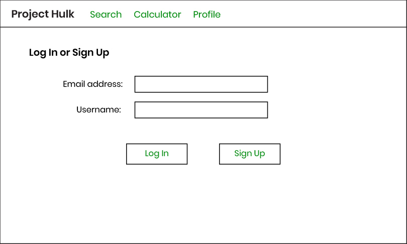
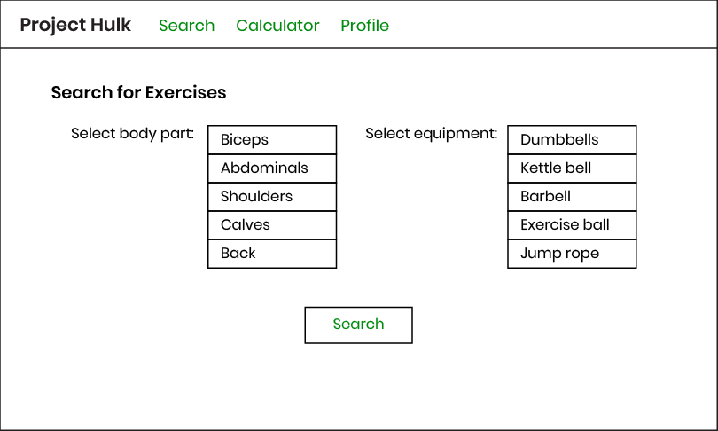
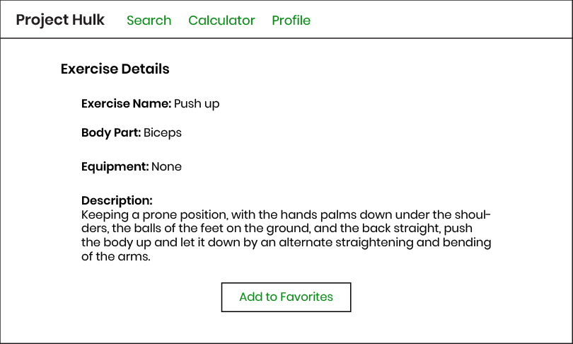

*I am treating the navbar as it's own page as to not duplicate this throughout the document*

# Component: Navbar

Link Destinations: 
- Clicking on Search navigates browser to the Search page
- Clicking on Calculator navigates browswer to the Calorie Calculator page
- Clicking Profile navigates the user to the User page

Tests: 
- All links should navigate the browser to the appropriate page

---
# Page Title: Login Sign In Page

Page Description:

Parameters: None

Data: No additional data needed to render the page

Link Destinations: 
- Clicking "Log in" sends a get request to our API to fetch the username from the associated sql table. If there is a match the browser navigates to the home page else the browser stays on the login page.
- Clicking "Sign up" sends a post request to our API and writes in the username and email address into the appropriate sql table. The browser then navigates to the homepage

Tests:
- Verify the login and sign-up buttons call the correct API and function as specified above
- On a successful sign and log-in the browser must navigate to the homepage
- On an unsuccessful log-in the browser should stay on the login page
- If the username already exists in the sql table the browser will just navigate to the homepage acting as a successful login.

---

# Page Title: Home

Description:

Parameters:None

Data: No additional data needed.

Link Destinations:
- “Search for Exercises” links to the Search webpage
- “Calorie Calculator” links to the Calorie Calculator webpage
- “User Page” links to the User page.
- “Login or Sign Up” links to the Login Page.

Tests:
- Each link must navigate the browser to the appropriate URL.

---

# Page Title: Search

Page Description:

Parameters: None

Data: 
- Select Body Part Form : {All body_part values from associated sql table}
- Select Equipment Form: {All equipment values from associated sql table}

Link Destinations: When a user clicks “Search”, the selected body part and equipment are stored in variables which are passed as parameters to the search_result url.

Tests:
- The data in the body part selection form will include and match all body parts stored in the associated sql table.
- The data in the equipment selection form will include and match all equipment stored in the associated sql table.
- When a body part is selected that body part must match the value stored in the body_part variable.
- When a piece of equipment is selected that equipment must match the value stored in the equipment variable.
- If no equipment or body parts are selected or if only one equipment or one body-part is selected, the search button will be grayed out and will not be clickable.
- If both the equipment and body parts  are selected the search button will be clickable and correctly navigate to the Search Results page.
---
# Page Title: Search Results

Page description:

Parameters:
- body_part
- equipment

Data: 
- Search Result Table 
    - Exercise { exercise values pulled from associated sql table matching body_part and equipment attributes }
    - Body Part {parameter - body_part}
    - Equipment {parameter - equipment}

Link Destinations:
- Each row of the search result table is a link to the associated exercise detail page. The particular exercise, body part, and equipment are passed as parameters to the exercise_detail url.
- The “New Search” button will simply redirect the browser back to the Search page.
- Clicking the star sends a post request with exercise, body_part, and equipment parameters to write the exercise into the favorites sql table.

Tests: 
- The body part and equipment attributes in the search result table will match those passed as parameters by the user from the search page
- Each exercise row in the search result table must be valid exercises stored in our sql table that match both of the parameters body_part and equipment.
- When a row is clicked the browser must successfully navigate to the Exercise Detail page.
- When the “New Search” button is clicked the browser must successfully redirect to the Search page.

---

# Page Title: Exercise Details

Description:

Parameters:
- exercise
- body_part
- equipment

Data:
- Exercise Name :{ parameter - exercise}
- Body Part: {parameter - body_part}
- Equipment: {parameter - equipment}
- Description: {description value is pulled from the sql table matching exercise, body_part, and equipment attributes}

Link Destinations: 

When clicked "Add to Favorites" sends a post request with exercise, body_part, and equipment parameters to write the exercise into the favorites sql table.

Tests:
- Exercise Name, Body Part and Equipment must match the parameters passed from the  previous webpage and be valid values in the related sql table.
- Description must match the description value in the associated sql table related to the particular exercise, equipment, and body-part attributes.

---

# Page Title : User Page

Page description : 

Parameters: None

Data:
- Username: {Username is retrieved from an sql table using the Session ID}
- Email: {Email value pulled from the associated sql table matching the username key}
 - Favorite Exercises Table 
    - Exercise {exercise values are pulled from the associated sql table matching the username key}
    - Body Part {body-part values are pulled from the associated sql table matching the username key}
    - Equipment {equipment values are pulled from the associated sql table matching the username key}

Link Destinations: 
- Each row of the favorite exercise table is a link to that exercise’s associated Exercise Detail Page. The particular exercise, body-part, and equipment are passed as parameters to the Excercize Detail url.

Tests:
- With no exercises favorited, the favorite exercise table must be empty.
- When exercises are favorited the rows of the table must match those exercises exactly.
- The correct email and username of the currently signed in user must match the username and email rendered on the page.
- When a user clicks the x on a row of the favorite exercise table, that row should be deleted from the table.
- The SessionID should match a Username in the sql table.

